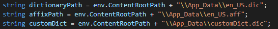

# EJ2 Document editor Services

## Available Web API services in EJ2 Document Editor
* Import
* SpellCheck
* SystemClipboard
* RestrictEditing

## Import
In order to import word documents into document editor you can make use of this service call. Also you can convert word documents (.dotx,.docx,.docm,.dot,.doc), rich text format documents (.rtf), and text documents (.txt) into SFDT format by using this Web API service implementation.

## SystemClipboard
You can make use of this service in order to paste system clipboard data by preserving the formatting.

## Spell Check

Document editor performs spell check by processing hunspell dictionary files, So kindly follow below steps to include the necessary files to perform spell check.

### Install ASP.NET Core SpellChecker as package in the application

To add [`Spellchecker in ASP.NET Core`](https://ej2.syncfusion.com/aspnetcore/documentation/nuget-packages#syncfusionej2spellcheckeraspnetcore) controls in the application, open the NuGet package manager in Visual Studio (Tools → NuGet Package Manager → Manage NuGet Packages for Solution), search for [Syncfusion.EJ2.SpellChecker.AspNet.Core](https://www.nuget.org/packages/Syncfusion.EJ2.SpellChecker.AspNet.Core/) and then install it.  Alternatively, you can utilize the following package manager command to achieve the same.




Install-Package Syncfusion.EJ2.SpellChecker.AspNet.Core -Version {{ site.releaseversion }}




>Syncfusion<sup style="font-size:70%">&reg;</sup> ASP.NET Core controls are available in [nuget.org.](https://www.nuget.org/packages?q=syncfusion.EJ2) Refer to [NuGet packages topic](https://ej2.syncfusion.com/aspnetcore/documentation/nuget-packages) to learn more about installing NuGet packages in various OS environments. The Syncfusion.EJ2.AspNet.Core NuGet package has dependencies, [Newtonsoft.Json](https://www.nuget.org/packages/Newtonsoft.Json/) for JSON serialization and [Syncfusion.Licensing](https://www.nuget.org/packages/Syncfusion.Licensing/) for validating Syncfusion<sup style="font-size:70%">&reg;</sup> license key.

### Where to find the dictionaries?
[Hunspell Dictionaries](https://github.com/wooorm/dictionaries) - Dictionary location

### Steps to configure spell checker

* In the application App_Data folder, include the dictionary, .aff dictionary files and JSON file. 


JSON file should contains the values in the following format.

```json
[
  {
    "LanguadeID": 1036, 
    "DictionaryPath": "fr_FR.dic",
    "AffixPath": "fr_FR.aff", 
    "PersonalDictPath": "customDict.dic"
  },
  {
    "LanguadeID": 1033,
    "DictionaryPath": "en_US.dic",
    "AffixPath": "en_US.aff",
    "PersonalDictPath": "customDict.dic"
  }
]
```

* For handling personal dictionary, place empty .dic file (ex. customDict.dic file) in the App_Data folder.

* Refer the added files in the spell checker service call as well where we will pass the file information
 
 
### How it works

* Spell checking will be performed based on the below information from client side and it will be passed to **GetSuggestions** API to process spell checker.

### LanguageID

* As mentioned document editor supports multi-language spell check. You can add as many languages (dictionaries) using **DictionaryData** class with unique ID for each language. Spell checking will be initiated only when languageID value passed in client side present in the **DictionaryData** collection. 


### TexttoCheck

* The text to be processed for spell checking.

### CheckSpelling
* Indicates spell checking need to be performed for the given text.

### CheckSuggestion
* Indicates whether to provide suggestions for the mis-spelled words.

### AddWord
* Indicates whether the text need to added in personal dictionary.

## RestrictEditing
Document Editor provides support for restrict editing. You can make use of this Web API service to encrypt/decrypt protected content. 
