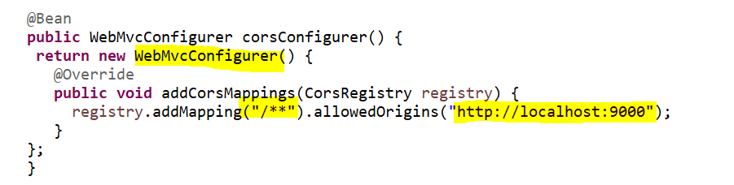
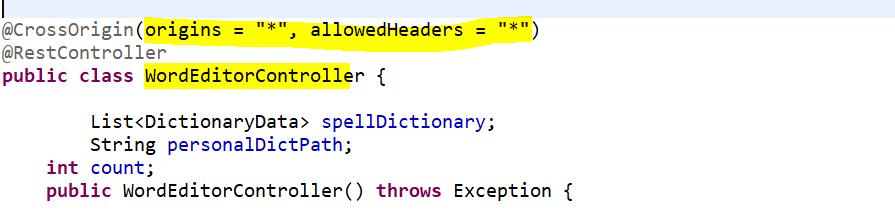
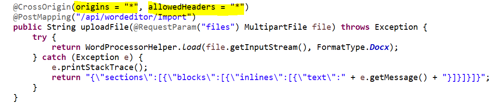
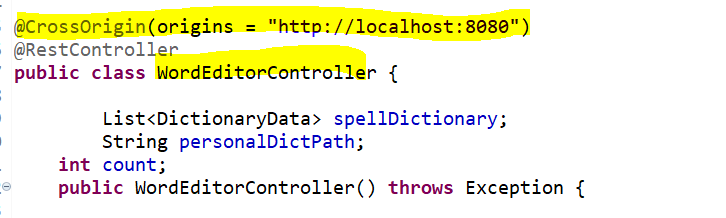
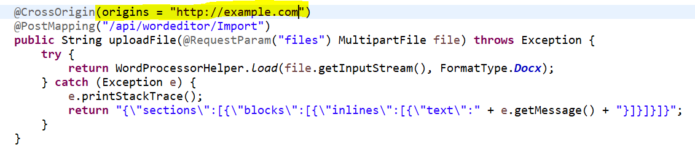

# EJ2 Document editor Services

EJ2 Webservices in java for WordEditor written in Java Spring Boot.

To run
```
gradlew bootRun
```
## Available Web API services in EJ2 Document Editor
* Import
* SystemClipboard
* RestrictEditing

### Import
In order to import word documents into document editor you can make use of this service call. Also you can convert word documents (.dotx,.docx,.docm,.dot,.doc), rich text format documents (.rtf), and text documents (.txt) into SFDT format by using this Web API service implementation.

### SystemClipboard
You can make use of this service in order to paste system clipboard data by preserving the formatting.

### RestrictEditing
Document Editor provides support for restrict editing. You can make use of this Web API service to encrypt/decrypt protected content. 

## Enabling Cross origin requests for WebAPIs
Cross-Origin Resource Sharing (CORS) is a protocol that enables scripts running on a browser client to interact with resources from a different origin. In the client side we can make only API calls to the URLs that live in the same origin where the script is running or else it will be blocked as per [Same-Origin policy](https://developer.mozilla.org/en-US/docs/Web/Security/Same-origin_policy)

When the server configured correctly to allow cross-origin resource sharing some special headers will be included in the response. Based on that browser will determine to proceed with the request or should fail.

### How to enable CORS in Java Spring boot
You can enable CORS per action, per controller, or globally for all Web API controllers in your application. Kindly follow below steps to achieve it.

### Enabling global CORS
 Enable CORS for the whole application be declaring `WebMvcConfigurer` bean



### Enabling CORS for specific WebAPI methods / Controller class (All Domain)
Configure WebAPI methods / Controller class to access from all the domains as below,

**Controller Level** 

**Method Level** 


### Enabling CORS for specific WebAPI methods / Controller class (Specific Domain)
Configure WebAPI methods / Controller class to access from specific domains as below,

**Controller Level** 

**Method Level** 



**NOTE**

Java Web Service project has already been configured with CORS origin in all the WebAPI methods.

---