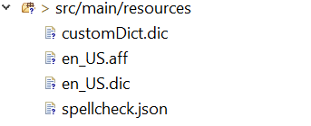
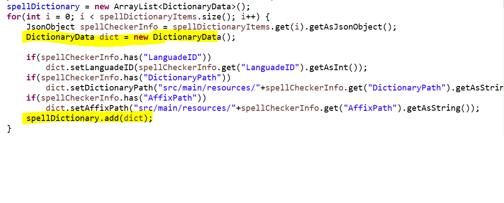

# EJ2 Document editor Services

EJ2 Webservices in java for WordEditor written in Java Spring Boot.

To run
```
gradlew bootRun
```
## Available Web API services in EJ2 Document Editor
* Import
* SystemClipboard
* RestrictEditing
* Export
* SpellCheck

### Import
In order to import word documents into document editor you can make use of this service call. Also you can convert word documents (.dotx,.docx,.docm,.dot,.doc), rich text format documents (.rtf), and text documents (.txt) into SFDT format by using this Web API service implementation.

### SystemClipboard
You can make use of this service in order to paste system clipboard data by preserving the formatting.

### RestrictEditing
Document Editor provides support for restrict editing. You can make use of this Web API service to encrypt/decrypt protected contnt. 

### Export
Document Editor provides support to convert (.Docx / .SFDT) to other file formats such as (DOC, RTF, HTML, WordML, Txt) in the server-side. You can make use of below WebAPI methods to achieve this behavior.

#### Exporting .Docx to other format types 
You can make use of this Web API method (Export) to convert .Docx to other format types which are supported in Syncfusion DocIO library. You can refer [this](https://help.syncfusion.com/java-file-formats/word-library/conversion) to know more about supported conversion types. Converted file will be sent to the client side for download.

#### Exporting .SFDT to other format types 
You can make use of this Web API method (ExportSFDT) to convert .SFDT to other format types which are supported in Syncfusion DocIO library. You can refer [this](https://help.syncfusion.com/java-file-formats/word-library/conversion) to know more about supported conversion types. Converted file will be sent to the client side for download.

#### Saving .SFDT to other format types
You can make use of this Web API method (Save) to convert .SFDT to other format types which are supported in Syncfusion DocIO library. You can refer [this](https://help.syncfusion.com/java-file-formats/word-library/conversion) to know more about supported types. Since on exporting, SFDT informations are passed to the DocIO library using **syncfusion-ej2-wordprocessor.jar** so we may encounter few elements missing in the exported file due to unsupported features. 

### Spell Check

Document editor performs spell check by processing hunspell dictionary files, So kindly follow below steps to include the necessary files to perform spell check.

#### Where to find the dictionaries?
[Hunspell Dictionaries](https://github.com/wooorm/dictionaries) - Dictionary location

#### Steps to configure spell checker

* In the application resource folder, include the dictionary, .aff dictionary files and JSON file. 



JSON file should contains the values in the following format.

```json
[
  {
    "LanguadeID": 1036, 
    "DictionaryPath": "fr_FR.dic",
    "AffixPath": "fr_FR.aff", 
    "PersonalDictPath": "customDict.dic"
  },
  {
    "LanguadeID": 1033,
    "DictionaryPath": "en_US.dic",
    "AffixPath": "en_US.aff",
    "PersonalDictPath": "customDict.dic"
  }
]
```

* For handling personal dictionary, place empty .dic file (ex. customDict.dic file) in the resource folder.

* Parse the JSON file before spell checker service call to provide the dictionary and affix path information to **syncfusion-ej2-spellchecker** Java library.
 
 
#### How it works

* Spell checking will be performed based on the below information from client side and it will be passed to **getSuggestions** API to process spell checker.

#### LanguageID

* As mentioned document editor supports multi-language spell check. You can add as many languages (dictionaries) using **DictionaryData** class with unique ID for each language. Spell checking will be initiated only when languageID value passed in client side present in the **DictionaryData** collection. 



#### TexttoCheck

* The text to be processed for spell checking.

#### CheckSpelling
* Indicates spell checking need to be performed for the given text.

#### CheckSuggestion
* Indicates whether to provide suggestions for the mis-spelled words.

#### AddWord
* Indicates whether the text need to added in personal dictionary.

## Enabling Cross origin requests for Web APIs
Cross-Origin Resource Sharing (CORS) is a protocol that enables scripts running on a browser client to interact with resources from a different origin. In the client side we can make only API calls to the URLs that live in the same origin where the script is running or else it will be blocked as per [Same-Origin policy](https://developer.mozilla.org/en-US/docs/Web/Security/Same-origin_policy)

When the server configured correctly to allow cross-origin resource sharing some special headers will be included in the response. Based on that browser will determine to proceed with the request or should fail.

### How to enable CORS in Java Spring boot
You can enable CORS per action, per controller, or globally for all Web API controllers in your application. Kindly follow below steps to achieve it.

### Enabling global CORS
 Enable CORS for the whole application be declaring `WebMvcConfigurer` bean


### Enabling CORS for specific WebAPI methods / Controller class (All Domain)
Configure WebAPI methods / Controller class to access from all the domains as below,

**Controller Level** 


**Method Level** 


### Enabling CORS for specific WebAPI methods / Controller class (Specific Domain)
Configure WebAPI methods / Controller class to access from specific domains as below,

**Controller Level** 


**Method Level** 


**NOTE**

Java Web Service project has already been configured with CORS origin in all the WebAPI methods.

---